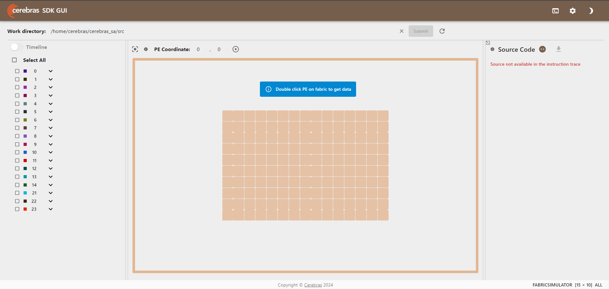

# cerebras_docker

Docker image for cerebras

## Build

Please place the tar.gz of the Cerebras SDK in this directory under the name `Cerebras-SDK.tar.gz`.

```console
cd /path/to/cerebras_docker
# Double quotes are required.
wget "[Cerebras-SDK Download Full Path]" -O Cerebras-SDK.tar.gz
```

```console
cerebras_docker
├── Cerebras-SDK.tar.gz  <-- Here
├── Dockerfile
├── XXX.sh
└── README.md
```

Then, build the Docker image by `build.sh`

```console
./build.sh
```

## Launch

### run docker image

Please set `AMPLIFY_TOKEN` environment.

```console
./run_cerebras.sh
```

### execute cerebras_sa in docker image

Please set `AMPLIFY_TOKEN` environment.

```console
./exec_cerebras_sa.sh
```

### run docker image without cerebras_sa (optional)

```console
cd /path/to/cerebras_docker
docker run -it --privileged --rm --name cerebras cerebras:${USER}
```

## Visualize

### Start visualizer in docker image



Run cerebras_sa in debug mode to generate simfab_traces before you use the visualizer.

Please change `cerebras_sa/config/small.toml` to the following diff.

```diff
--- a/config/small.toml
+++ b/config/small.toml
-suppress_simfab_trace = true
+suppress_simfab_trace = false
```

```console
# run cerebras_sa in debug mode ( suppress_simfab_trace = false)
./exec_cerebras_sa.sh
# start visualizer
./visualize_cerebras_sa.sh
```
